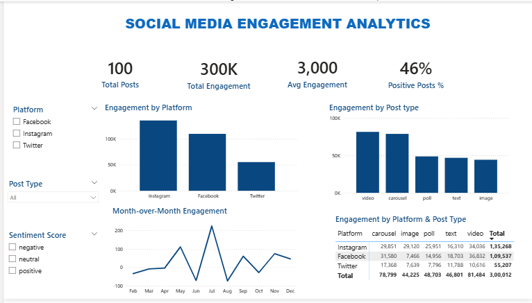

## Social Media Engagement Analysis
I analyzed social media post data to understand how engagement varies across platforms, post type, sentiment.
The project uses Excel/Power Query for data cleaning, PostgreSQL for analysis, and Power BI for visualization.

## Business Questions

- Which platform has the highest overall engagement?
- Which post types receive the most engagement?
- How does engagement vary across platforms and post types?
- What percentage of posts have positive sentiment?
- Which posts have the highest engagement?
- How does engagement change over time?

## Tools Used

- Excel / Power Query – data cleaning and preparation
- PostgreSQL – SQL analysis
- Power BI – data visualization and dashboard

## Data Cleaning

The raw data was cleaned using Excel and Power Query.

- Checked for missing and duplicate values
- Corrected data types for numeric and date fields
- Cleaned and standardized the post date and time data
- Created a separate date field for analysis
- Verified the cleaned data before loading it into PostgreSQL and Power BI

## SQL Analysis

I used PostgreSQL to analyze the cleaned data and answer questions related to:

- Total and average engagement
- Engagement by platform and post type
- Engagement by sentiment
- Top-performing posts
- Top posts within each platform
- Posts with engagement above the overall average
- Monthly engagement trends

## Power BI Dashboard

The cleaned data was connected to Power BI to create an interactive dashboard.

The dashboard includes:

- Total posts and total engagement
- Engagement by platform
- Engagement by post type
- Positive sentiment percentage
- Top-performing posts
- Monthly engagement trends
- Platform-level engagement comparison

## Key Findings

- Instagram recorded the highest engagement among the three platforms, followed by Facebook and Twitter.
- Video posts generated the highest engagement among the post types, while image posts had the lowest.
- Positive posts accounted for 46% of all posts.
- Engagement showed noticeable month-to-month changes, with the largest increase occurring in July.

## Dashboard Preview

## Project Files

- `Social_media_engagement.xlsx` – Raw/cleaned data and Excel work
- `social_media_engagement_analysis.sql` – SQL queries used for analysis
- `social_media_engagement_dashboard.pbix` – Power BI dashboard
- `social_media_engagement_dashboard.png` – Dashboard preview

## Conclusion

This project helped me practice the complete data analysis workflow, from cleaning and analyzing data to building a Power BI dashboard. It also helped me understand how social media engagement varies across platforms, post types, and sentiment.
